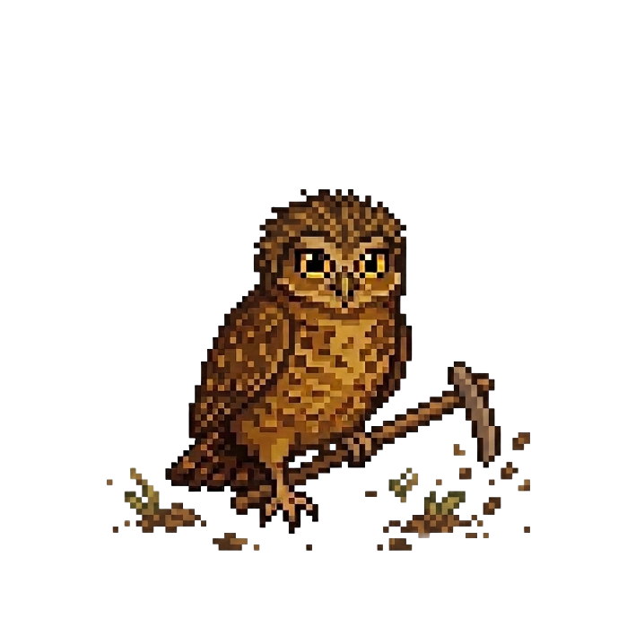

<div align="center">
  
  <h1>AgroFloresta na Escola</h1>
  <p><em>Vivências para o Amanhã</em></p>
  
  
  
  
  
  

  <br/>
  
  <a href="https://heitorovski01.github.io/Agrofloresta/"><strong>🌿 Acesse o site</strong></a>
</div>

## Sobre o Projeto 🌿
A AgroFloresta na Escola é um projeto de extensão universitária da UnB (Universidade de Brasília) em parceria com o CEL (Centro educacional do lago) que leva o conhecimento agroflorestal para o ambiente escolar. Unindo a sabedoria ancestral do Cerrado com práticas científicas, promovemos a regeneração ambiental e a segurança alimentar. O projeto é cultivado de forma colaborativa por professores, estudantes e pela comunidade, fortalecendo o vínculo com a natureza e os saberes locais.

| Tema | Descrição |
| :--- | :--- |
| 🥕 Alimentos | Produção sustentável de alimentos saudáveis no bioma Cerrado. |
| 📚 Conhecimento | Integração de saberes científicos e tradicionais nas escolas. |
| 🌿 Meio Ambiente | Conservação e restauração de ecossistemas nativos. |
| 🤝 Comunidade | Fortalecimento de vínculos entre escola, família e natureza. |

## Estrutura do Projeto 📂
```text
agrofloresta/
├── .github/          # Workflows do GitHub Actions
├── assets/           # Recursos principais do site
│   ├── css/          # Estilos globais
│   ├── img/          # Imagens (mascote, equipe, reels)
│   └── js/           # Scripts globais (menu mobile, etc.)
├── jogos/
│   └── jogo1/        # Minigame "Colheita Agroflorestal"
│       ├── assets/   # Sprites, sons e scripts do jogo
│       └── index.html
├── tests/            
│   ├── e2e/          # Testes de Interface e Acessibilidade (Playwright)
│   └── *.test.js     # Testes Unitários (Vitest)
├── index.html        # Página principal
├── package.json      # Dependências e scripts npm
├── eslint.config.js  # Configuração do Linter (ESLint)
├── playwright.config.js # Configuração do Playwright
├── vitest.config.js  # Configuração do Vitest
├── .prettierrc       # Configuração do Formatter
├── LICENSE
└── README.md
```

## Como Rodar Localmente 💻
1. Clone o repositório:
   `git clone https://github.com/Heitorovski01/Agrofloresta.git`
2. Instale as dependências de desenvolvimento:
   `npm install`
3. Abra o arquivo `index.html` em seu navegador ou inicie um servidor local (como *Live Server* ou `http-server`).

## Qualidade e Testes 🧪
O repositório possui uma suíte automatizada para garantir a qualidade de código e acessibilidade.

Para executar todos os testes locais de uma única vez (Linter, Unitários e E2E), utilize:
```bash
npm run test:all
```
*(Para os testes E2E funcionarem na primeira vez, certifique-se de instalar os navegadores com `npx playwright install`)*

**Ferramentas Utilizadas:**
- **ESLint & Prettier:** Padronização e formatação de código JavaScript.
- **HTMLHint:** Validação de sintaxe HTML.
- **Vitest:** Testes unitários de lógica do jogo.
- **Playwright & Axe-Core:** Testes de ponta a ponta (E2E) simulando interações reais em múltiplos navegadores e escaneando problemas de acessibilidade na interface.

## Jogos 🎮
| Nome | Status | Pasta | Jogue |
| :--- | :--- | :--- | :--- |
| Colheita Agroflorestal (Semeador) | ✅ Concluído | `jogos/jogo1/` | [🎮 Jogar](https://heitorovski01.github.io/Agrofloresta/jogos/jogo1/index.html) |

*O minigame permite controlar uma minhoca que coleta sementes nativas do Cerrado e prepara o solo, contando com ranking local de pontuação!*

## Equipe 👥
Projeto desenvolvido por estudantes, professores e comunidade em parceria com UnB e CEL.

- **Tatiana** — Professora do Projeto
- **Danielly Vitória** — Estudante de Geografia
- **Ana Sofia** — Estudante de Ciências Ambientais
- **Cristiane Lima** — Estudante de Geografia
- **Heitor Pinheiro** — Estudante de Engenharia de Software

## Contribuindo 🤝
1. Faça um **Fork** do projeto.
2. Crie uma **Branch** para sua funcionalidade: `git checkout -b feat/minha-feature`.
3. Faça o **Commit** de suas alterações seguindo o padrão *Conventional Commits*:
   
| Tipo | Descrição |
| :--- | :--- |
| feat | Nova funcionalidade |
| fix | Correção de bug |
| refactor | Alteração no código que não muda comportamento |
| style | Formatação, pontos e vírgulas, etc |
| docs | Alterações na documentação |
| chore | Mudanças em ferramentas ou build |

4. Abra um **Pull Request**.

## Licença 📜
Distribuído sob a licença MIT. Veja `LICENSE` para mais informações.

## Contato ✉️
- Instagram: [@agroflor3sta](https://www.instagram.com/agroflor3sta/)
- Email: agroflor3sta@gmail.com

